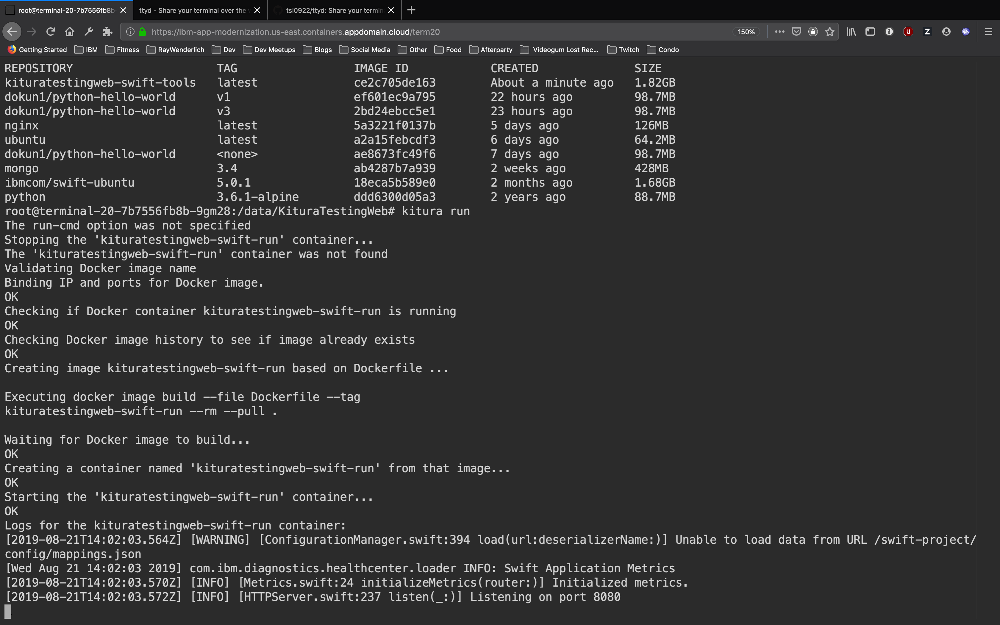

# Web-based Command Line for Developer Workshops

Do you want to run a hands-on workshop with developers on client site? Do the developers who are participating have zero ability to install anything to run the workshop on their machines? Can they access a website with a signed TLS cert from a CA? Well then this is the tutorial for you!

While this is an open source offering, this is currently configured to work for the IBM Kubernetes Service. Changes to `web-terminal-ingress.yaml` would be required for deployment to another managed Kubernetes service.

This will set up a fully functioning bash shell inside an ubuntu container for you, with the following things pre-installed:

- Docker
- Kubectl
- Helm
- IBM Cloud CLI

Additionally, this gives you the ability to install just about any other runtime you'd like for a multitude of workshops, including:

- Node.js (Blockchain workshops)
- Java (App Modernization workshops)
- Python (Machine Learning workshops)
- Swift (Best workshops)



You can configure this to set up as many terminals as you want for as many people as you want (within reason), and each participant will have their own persistent storage for Docker images and their file system.

### Getting Started

You'll need to have access to a Kubernetes cluster, and that Kubernetes cluster must be able to use a remote image from Dockerhub. Additionally, this cluster must be able to configure an ingress controller (free IKS will not work for setting up DNS and TLS certs).

You should have answers to the following questions:

- How many people are in my workshop?
- Can they access the url https://testing-cluster.us-east.containers.appdomain.cloud/ from their machines?
- Has everyone who will be participating in the workshop signed up for an IBM Cloud account?

Once you have these answers, you can proceed. This tutorial will assume you are using a cluster on the IKS.

### Maintenance

If you are interested in contributing to this facility:

**GitHub**: https://github.com/IBMAppModernization/web-terminal  
**DockerHub**: https://hub.docker.com/r/ibmappmodernization/web-terminal

Please get in touch with [David Okun](https://github.com/dokun1) or [Tim Robinson](https://github.com/timroster) if you have questions.

### Step 0

You will need a few tools installed locally first. You can find specific instructions for your specific machine on the corresponding websites.

- Kubectl
- Helm (minimum version: 2.14.3)
- IBM Cloud CLI

### Step 1

Provision a Kubernetes cluster. Again, if you are using the IKS, you cannot use the free cluster, as the free cluster:

- can not leverage a persistent volume
- can not leverage an ingress controller

In Terminal, log into IBM Cloud with `ibmcloud login`. Run `ibmcloud ks clusters` to get the name of your cluster:

```bash
testing-cluster           bkss2low0aucnromsrm0               normal   2 weeks ago   1         Washington D.C.   1.13.8_1529   dokun-personal
```

The name of your cluster, in this instance, is `testing-cluster`.

### Step 2

Next, get the details of DNS and the TLS secret on your cluster with the command `ibmcloud ks cluster-get --cluster testing-cluster | grep Ingress`. Your output should look like this:

```bash
Ingress Subdomain:              testing-cluster.us-east.containers.appdomain.cloud
Ingress Secret:                 testing-cluster
```

Keep track of these values for later.

### Step 3

Run the command `git clone https://github.com/IBMAppModernization/web-terminal.git`, then `cd web-terminal`. First, open `chart/web-terminal/values.yaml` in a text editor of your choice. Make the following changes:

- `participantCount`: this should be a number, and will set up that many terminal instances at `/term1`, `/term2`, etc...
- `tlsSecret`: the name of your TLS secret from Step 2
- `fullDomain`: the full domain of your cluster from Step 2
- `repository`: by default, this should be `ibmappmodernization/web-terminal` to use our Docker image, but feel free to use your own if you have another image
- `tag`: you have choices, check out the available tags [here](https://hub.docker.com/r/ibmappmodernization/web-terminal/tags)

Save your file.

### Step 4

Connect to your Kubernetes cluster. To do this, open Terminal and enter the following commands:

```bash
ibmcloud ks clusters
```

Find the name of your cluster, then enter the following command:

```bash
$(ibmcloud ks cluster config your-cluster-name | grep export)
```

This should automatically connect you to your cluster. To confirm, enter the following commands:

```bash
kubectl cluster-info
kubectl get all
```

You should see that you are connected to your cluster.

### Step 5

**Note**: If you have already set up Helm, skip to Step 6.

[Helm](https://helm.sh/) is a package manager that you will use to install this web terminal in one line. Helm is not installed on IKS clusters by default, so you need to set up your cluster one time to use it. You will enter four commands in the following sequence:

```bash
kubectl create serviceaccount --namespace kube-system tiller
kubectl create clusterrolebinding tiller-cluster-rule --clusterrole=cluster-admin --serviceaccount=kube-system:tiller
helm init --upgrade
kubectl patch deploy --namespace kube-system tiller-deploy -p '{"spec":{"template":{"spec":{"serviceAccount":"tiller"}}}}'
```

After this, you need to wait for Tiller, the server-side component of Helm, to finish installing. This usually takes 1-2 minutes. To confirm you have installed Helm correctly, enter `helm list`. If you get no output as a result, you are ready.

### Step 6

In your own Terminal, ensure that you are at the root directory of `web-terminal` by typing `ls`.  You should see that you have `chart/` in the output. Next, enter the following command:

```bash
helm install --name web-terminal chart/web-terminal/
```

And that's it! You should see output that indicates all of the resources deployed to your kubernetes cluster. Depending on how many participants are in your workshop, this could vary in setup time anywhere from 30 seconds to 4 minutes. After making some coffee, type `kubectl get all` to see output that looks like so:

```bash
NAME                              READY   STATUS    RESTARTS   AGE
pod/terminal-1-6755b9c4cb-m64jf   2/2     Running   0          28s
pod/terminal-2-6464689886-g9pwx   2/2     Running   0          28s
pod/terminal-3-7948498fc6-cszms   2/2     Running   0          28s

NAME                              TYPE        CLUSTER-IP       EXTERNAL-IP   PORT(S)          AGE
service/external-service-3000-1   NodePort    172.21.178.20    <none>        8080:31578/TCP   28s
service/external-service-3000-2   NodePort    172.21.30.97     <none>        8080:31914/TCP   28s
service/external-service-3000-3   NodePort    172.21.26.200    <none>        8080:32539/TCP   28s
service/external-service-5000-1   NodePort    172.21.171.94    <none>        8081:30403/TCP   28s
service/external-service-5000-2   NodePort    172.21.121.179   <none>        8081:32131/TCP   28s
service/external-service-5000-3   NodePort    172.21.6.50      <none>        8081:31205/TCP   28s
service/external-service-8080-1   NodePort    172.21.250.82    <none>        8082:32275/TCP   28s
service/external-service-8080-2   NodePort    172.21.255.233   <none>        8082:32010/TCP   28s
service/external-service-8080-3   NodePort    172.21.161.139   <none>        8082:30701/TCP   28s
service/external-service-8081-1   NodePort    172.21.178.187   <none>        8083:30938/TCP   28s
service/external-service-8081-2   NodePort    172.21.42.201    <none>        8083:30834/TCP   28s
service/external-service-8081-3   NodePort    172.21.28.195    <none>        8083:30719/TCP   28s
service/kubernetes                ClusterIP   172.21.0.1       <none>        443/TCP          33d
service/terminal-service-1        NodePort    172.21.212.23    <none>        80:32064/TCP     28s
service/terminal-service-2        NodePort    172.21.117.25    <none>        80:31026/TCP     28s
service/terminal-service-3        NodePort    172.21.103.66    <none>        80:32153/TCP     28s

NAME                         READY   UP-TO-DATE   AVAILABLE   AGE
deployment.apps/terminal-1   1/1     1            1           28s
deployment.apps/terminal-2   1/1     1            1           28s
deployment.apps/terminal-3   1/1     1            1           28s

NAME                                    DESIRED   CURRENT   READY   AGE
replicaset.apps/terminal-1-6755b9c4cb   1         1         1       28s
replicaset.apps/terminal-2-6464689886   1         1         1       28s
replicaset.apps/terminal-3-7948498fc6   1         1         1       28s
```

Next, type `kubectl describe ing` to observe how ingress is set up on your cluster for this app:

```bash
Name:             terminal-ingress
Namespace:        default
Address:          169.45.224.22
Default backend:  default-http-backend:80 (<none>)
TLS:
  ibm-app-modernization terminates ibm-app-modernization.us-east.containers.appdomain.cloud
Rules:
  Host                                                      Path  Backends
  ----                                                      ----  --------
  ibm-app-modernization.us-east.containers.appdomain.cloud
                                                            /term1       terminal-service-1:80 (172.30.95.151:7681)
                                                            /ext3000-1   external-service-3000-1:8080 (172.30.95.151:3000)
                                                            /ext5000-1   external-service-5000-1:8081 (172.30.95.151:5000)
                                                            /ext8080-1   external-service-8080-1:8082 (172.30.95.151:8080)
                                                            /ext8081-1   external-service-8081-1:8083 (172.30.95.151:8081)
                                                            /term2       terminal-service-2:80 (172.30.95.148:7681)
                                                            /ext3000-2   external-service-3000-2:8080 (172.30.95.148:3000)
                                                            /ext5000-2   external-service-5000-2:8081 (172.30.95.148:5000)
                                                            /ext8080-2   external-service-8080-2:8082 (172.30.95.148:8080)
                                                            /ext8081-2   external-service-8081-2:8083 (172.30.95.148:8081)
                                                            /term3       terminal-service-3:80 (172.30.95.156:7681)
                                                            /ext3000-3   external-service-3000-3:8080 (172.30.95.156:3000)
                                                            /ext5000-3   external-service-5000-3:8081 (172.30.95.156:5000)
                                                            /ext8080-3   external-service-8080-3:8082 (172.30.95.156:8080)
                                                            /ext8081-3   external-service-8081-3:8083 (172.30.95.156:8081)
Annotations:
  ingress.bluemix.net/proxy-connect-timeout:  serviceName=terminal-service-1 timeout=75s;  serviceName=external-service-30001 timeout=75s; serviceName=external-service-5000-1 timeout=75s; serviceName=external-service-8080-1 timeout=75s; serviceName=external-service-8081-1 timeout=75s;serviceName=terminal-service-2 timeout=75s;  serviceName=external-service-30002 timeout=75s; serviceName=external-service-5000-2 timeout=75s; serviceName=external-service-8080-2 timeout=75s; serviceName=external-service-8081-2 timeout=75s;serviceName=terminal-service-3 timeout=75s;  serviceName=external-service-30003 timeout=75s; serviceName=external-service-5000-3 timeout=75s; serviceName=external-service-8080-3 timeout=75s; serviceName=external-service-8081-3 timeout=75s;
  ingress.bluemix.net/proxy-read-timeout:     serviceName=terminal-service-1 timeout=3600s; serviceName=external-service-3000-1 timeout=3600s; serviceName=external-service-5000-1 timeout=3600s; serviceName=external-service-8080-1 timeout=3600s; serviceName=external-service-8081-1 timeout=3600s;serviceName=terminal-service-2 timeout=3600s; serviceName=external-service-3000-2 timeout=3600s; serviceName=external-service-5000-2 timeout=3600s; serviceName=external-service-8080-2 timeout=3600s; serviceName=external-service-8081-2 timeout=3600s;serviceName=terminal-service-3 timeout=3600s; serviceName=external-service-3000-3 timeout=3600s; serviceName=external-service-5000-3 timeout=3600s; serviceName=external-service-8080-3 timeout=3600s; serviceName=external-service-8081-3 timeout=3600s;
  ingress.bluemix.net/rewrite-path:           serviceName=terminal-service-1 rewrite=/; serviceName=external-service-3000-1 rewrite=/; serviceName=external-service-5000-1 rewrite=/; serviceName=external-service-8080-1 rewrite=/; serviceName=external-service-8081-1 rewrite=/;serviceName=terminal-service-2 rewrite=/; serviceName=external-service-3000-2 rewrite=/; serviceName=external-service-5000-2 rewrite=/; serviceName=external-service-8080-2 rewrite=/; serviceName=external-service-8081-2 rewrite=/;serviceName=terminal-service-3 rewrite=/; serviceName=external-service-3000-3 rewrite=/; serviceName=external-service-5000-3 rewrite=/; serviceName=external-service-8080-3 rewrite=/; serviceName=external-service-8081-3 rewrite=/;
  kubernetes.io/ingress.class:                nginx
Events:
  Type    Reason   Age    From                                                 Message
  ----    ------   ----   ----                                                 -------
  Normal  Success  2m11s  public-crblt9hsew0nlkd0hg2lbg-alb1-544db8bfd8-c5db4  Successfully applied ingress resource.
```

This indicates that the following web-terminal URLs are ready to access:

- `https://testing-cluster.us-east.containers.appdomain.cloud/term1`
- `https://testing-cluster.us-east.containers.appdomain.cloud/term2`
- `https://testing-cluster.us-east.containers.appdomain.cloud/term3`
- `https://testing-cluster.us-east.containers.appdomain.cloud/term4`
- `https://testing-cluster.us-east.containers.appdomain.cloud/term5`

Each terminal has its own file system and Docker engine, meaning that workshop participants never have to use another terminal as long as they are in the workshop.

Additionally, you also have URLs available to test localhost deployments inside your container. For example, if you are using `/term1`, then you have these urls available:

- `https://testing-cluster.us-east.containers.appdomain.cloud/ext3000-1`
- `https://testing-cluster.us-east.containers.appdomain.cloud/ext5000-1`
- `https://testing-cluster.us-east.containers.appdomain.cloud/ext8080-1`
- `https://testing-cluster.us-east.containers.appdomain.cloud/ext8081-1`

If you run a docker container with port 	3000 exposed inside `/term1`, then you should be able to access that container at the `/ext3000-1` link.

**IMPORTANT NOTE:** When participants begin the workshop, make sure they navigate to `/data` in their root directory, and work with all files from this directory. This has read and write permissions, and will allow them to use whatever they want without issue.

### Step 7 (cleanup)

In terminal, enter the following command:

```bash
helm delete --purge web-terminal
```

After about 1 minute, enter `kubectl get all` to ensure that all related resources have been cleaned up. 

(**NB**: If you want to just scrub the file system for all running terminals and merely reset for another workshop, you can just ignore the previous step.)

To ensure that your persistent storage is wiped clean for future workshops using this cluster, ensure that you are still at the root directory of this repository, and enter the following command:

```bash
kubectl create -f scrub-dind.yaml
```

This will purge all of the storage used for Docker images and file systems. Count to 30, then enter the following command:

```bash
kubectl delete -f scrub-dind.yaml
```

This will delete the pod that purges the file system, and you are ready to go again.

## Warnings

There are some normal considerations to using this system.

1. The IKS shared VMs only have 100GB of file storage space available. For a 5 person workshop, this is not a big deal, but as the number of workshop participants increase, the shared space will decrease. Be mindful of this as you scale this, and encourage pair programming for larger groups. If you want to circumvent this issue with a bare metal kube cluster with 2TB, I hope you can pay for it!
2. If multiple people attempt to access one URL, the websocket system can crash the pod. It will restart, but it can take 1-3 minutes sometimes depending on connectivity. Encourage participants to keep their browser window open throughout the workshop and not close it or refresh the page.
3. The page **will** auto-refresh once per hour if no activity is detected. Filesystems, IBM Cloud CLI sessions, and Docker images/containers will persist, but history can be lost when this app refreshes. This isn't a major issue, but something to be mindful of.

### Questions

You can find us on Twitter [@dokun24](https://twitter.com/dokun24) and [@timroexp](https://twitter.com/timroexp), or you can email us [here](mailto:david.okun@ibm.com) or [here](mailto:timro@us.ibm.com).
